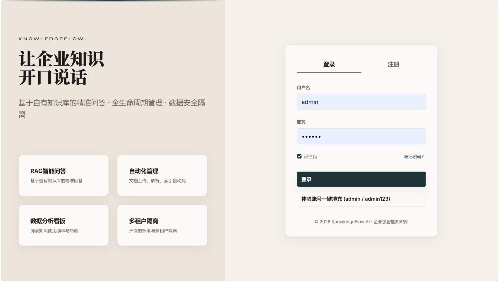
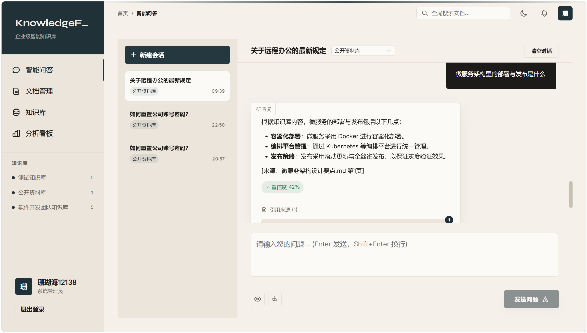
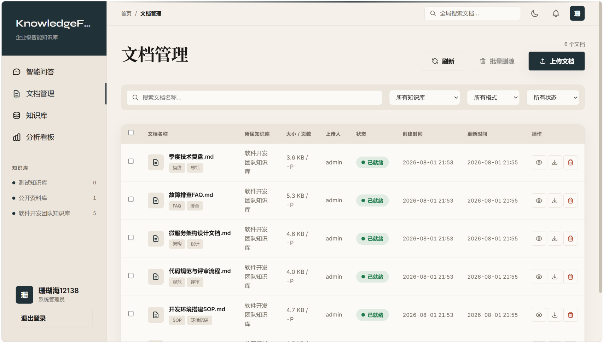
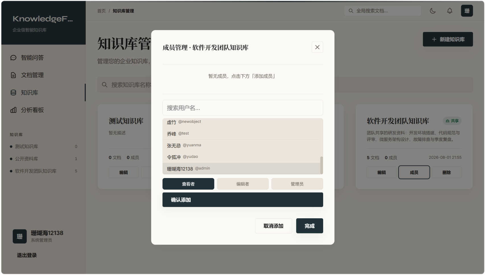
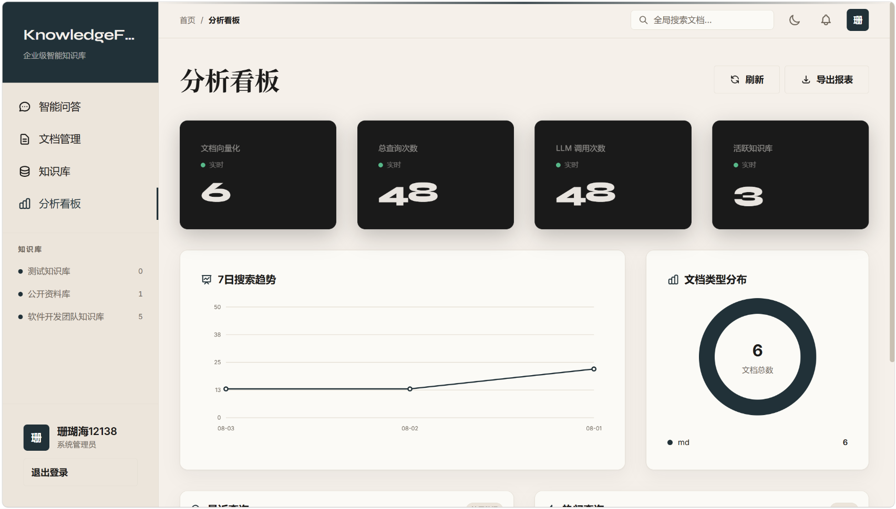

# KnowledgeFlow AI

> 企业级知识管理与 RAG 智能问答平台 —— 上传文档，即可获得带引用来源的智能问答与自动化 Agent 工作流。

**一句话定位**：企业知识管理 + RAG 智能问答 + Agent 工作流。通用空壳平台 + 内置演示知识库，开箱即演示，换种子数据即可转向任意垂直行业。

> 💬 **写在最前**
> 这个项目可以说是我当前技术栈的**巅峰之作**（可能？😄）——从 Spring Boot + Vue 3 的全栈基建，到 FastAPI + LangGraph 的 AI 编排，再到编辑社论风的前端视觉，功能丰富、前端炫酷 amazing。
> 当然，它也**尚未完全完工**，仍在持续打磨中——敬请期待后续版本～

---

## ✨ 特性

- **智能问答（流式 + 引用 + 置信度）**：基于知识库检索的流式回答（SSE），带引用来源卡片与置信度，多轮上下文
- **Agent 工作流（human-in-the-loop）**：LangGraph 编排「检索 → 摘要 → 分类 → 生成报告」，报告生成前人工确认
- **多租户知识库**：私有/共享可见性、成员角色管理（ADMIN/EDITOR/VIEWER）、租户隔离
- **文档异步流水线**：上传 → Redis Streams 驱动 → 解析分块 → 向量化 → 可检索，状态全程可见
- **分析看板**：文档/查询统计、趋势、热门检索词、文档类型分布
- **AI 配置界面填 Key**：登录后在「AI 设置」页填入模型 API Key 即可，无需改任何配置文件（AES 加密存储）
- **一键部署**：Docker Compose 一键启动全部 7 个服务（MySQL / Redis / MinIO / Qdrant / 后端 / AI / 前端）

## 🏗️ 架构

```
┌──────────────────────────────────────────────────────────────┐
│  Vue 3 前端（Element Plus，编辑社论风）                        │
│        │  REST / SSE（流式）                                  │
│        ▼                                                      │
│  Spring Boot 3 后端（RuoYi-Vue-Pro 基座）                     │
│  ├─ 认证/RBAC、知识库、文档、搜索转发、统计、运行时治理         │
│  │        │  HTTP（REST / SSE）                               │
│  │        ▼                                                   │
│  Python AI 编排服务（FastAPI + LangGraph）                    │
│  ├─ 分块 → embedding → 检索 → 流式生成 / Agent 工作流         │
│  └─ LLM 适配层：DeepSeek / OpenAI 兼容（界面配置 Key）        │
└──────────────────────────────────────────────────────────────┘
        ▼
  MySQL（业务）   Qdrant（向量）   Redis + Streams（缓存/异步）
  MinIO（文件）    LLM API（DeepSeek 等）
```

**语言分工**：Java 负责业务与权限（纯后端管理），Python 负责 AI 编排（检索/生成/Agent），通过 HTTP 通信——模块边界清晰，便于答辩讲解与团队分工。

## 🚀 快速开始

### 方式一：Docker 一键启动（推荐）

```bash
cd deploy
cp .env.example .env          # 开发默认值
docker compose up -d --build  # 一键构建并启动全部 7 个服务（含种子数据自动灌入）
```

启动后访问：

| 服务 | 地址 |
|------|------|
| 前端 | http://localhost:8080 （账号 `admin / admin123`） |
| 后端 Knife4j | http://localhost:48080/doc.html |
| AI 服务 | http://localhost:8000/docs |
| MinIO / Qdrant 控制台 | http://localhost:9001 / http://localhost:6333/dashboard |

### 方式二：本地进程开发

```bash
# 1. 基础设施
cd deploy && cp .env.example .env && docker compose up -d   # mysql/redis/minio/qdrant

# 2. 后端（:48080）
cd backend
mvn install -DskipTests -pl yudao-server -am
java -jar yudao-server/target/yudao-server.jar

# 3. AI 服务（:8000）
cd ai-service
python -m venv .venv && .venv/Scripts/activate
pip install -r requirements.txt
uvicorn main:app --host 0.0.0.0 --port 8000

# 4. 前端（:5173）
cd frontend && npm install && npm run dev
```

> 首次启动后如需重新灌入演示数据：`python deploy/seed/run_seed.py`（走真实流水线，幂等）。

## 🔑 AI 配置（开源用户友好）

1. 登录后进入 **「AI 设置」** 页面
2. 填入模型 API Key（如 DeepSeek）、API 地址与模型名，点击保存
3. 点击「测试连接」验证 —— 真实调用模型，返回「连接正常，模型已响应」
4. 未配置 Key 时，问答/Agent 会明确提示「请配置 API Key」，不会静默失败

> Key 以 AES 加密存储（`CONFIG_SECRET` 环境变量派生密钥），**永不明文回显**，仅管理员可配置。

## 📸 截图（演示素材清单）

> 建议在 1440px 宽的浏览器窗口截图，存入 `docs/screenshots/`，文件名按下表；截图后上方图片自动显示。

| 文件 | 页面 | 展示内容 | 操作 |
|------|------|----------|------|
| `login.png` | 登录页 | 编辑社论风品牌区 + 开场动画署名 `- by shanhuhai12138` | 打开 `http://localhost:8080` |
| `chat.png` ★ | 智能问答 | 流式回答 + 引用来源卡片 + 置信度 | 登录后「智能问答」问「代码评审流程是什么？」 |
| `documents.png` | 文档管理 | 种子文档列表 + 状态徽标（已就绪/处理中） | 左侧「文档管理」 |
| `kb.png` | 知识库 | 知识库卡片 + 成员管理（金庸人物：令狐冲/黄蓉…） | 「知识库」→ 打开知识库 → 成员管理 |
| `analytics.png` | 分析看板 | 统计卡数字滚动 + 7 日趋势 + 文档类型分布 | 「分析看板」 |
| `dark-chat.png`（可选） | 任意页 | 深色模式 | 顶栏切换深色后再截一张 |

**登录页开场动画**（SVG 动效，GitHub 支持渲染 SMIL 动画；效果与真实开场一致）：


### 界面预览







*深色模式：顶栏可切换，`dark-chat.png` 见 `docs/screenshots/`。*

## ▶️ 5 分钟演示流程（答辩/展示用）

> 日常体验用 **http://localhost:5173**（开发模式，`cd frontend && npm run dev`）；`http://localhost:8080` 是 Docker 部署版（答辩/交付演示用），两者功能一致。

1. 打开 `http://localhost:5173`（电影感开场动画，右下角 `- by shanhuhai12138`）
2. 登录 `admin / admin123`（登录页有「一键填入」）
3. **智能问答**：问「代码评审流程是什么？」→ 展示流式打字机 + 引用来源卡片 + 置信度；再追问一句验证多轮上下文
4. **文档管理**：展示预置的 5 篇种子文档（已就绪状态），上传新文档看 `处理中 → 已就绪` 流转
5. **知识库**：打开「软件开发团队知识库」→ 成员管理，成员是金庸笔下的经典人物
6. **分析看板**：统计卡 + 真实图表
7. （加分）**AI 设置**：管理员可配置模型 API Key，测试连接一键验证链路

## 🧰 技术栈

| 层 | 选型 |
|----|------|
| 后端 | Spring Boot 3 + MyBatis-Plus + Spring Security/JWT（RuoYi-Vue-Pro 基座） |
| AI | FastAPI + LangGraph + Qdrant + OpenAI 兼容客户端（DeepSeek） |
| 前端 | Vue 3 + Vite + TypeScript + Element Plus + Pinia |
| 基础设施 | MySQL 8 + Redis 7（Streams）+ MinIO + Qdrant（Docker Compose 编排） |

## 📚 文档

- [项目计划书（设计基准：数据模型 / 设计规范 / API 契约）](docs/项目计划书.md)
- [代码框架与开发任务书（执行指南 T1~T7）](docs/代码框架与开发任务书.md)
- [验收脚本（docs/verify/）](docs/verify/)：各模块端到端验收，可复跑

## 🤝 致谢

- 后端基座：[RuoYi-Vue-Pro](https://gitee.com/zhijiantianya/ruoyi-vue-pro)（认证/RBAC/代码生成器）
- RAG 分块器参考：[regent](https://github.com/)（中文感知递归分块）
- 前端视觉：编辑社论风（Editorial）设计体系

## 📄 License

[MIT](LICENSE) © shanhuhai12138
